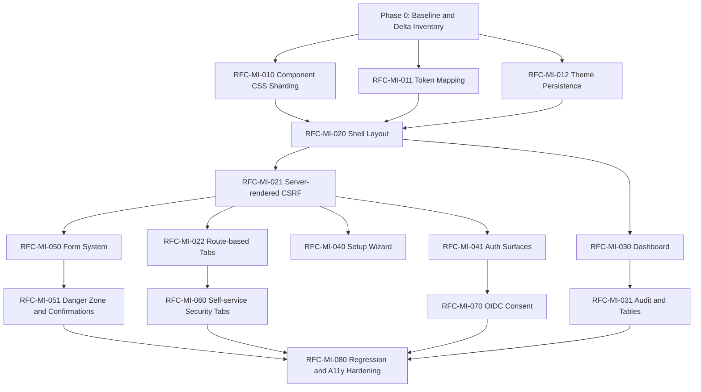

# sui-id Mockup Integration Migration Plan — Revised After Review

Version: v0.2  
Source context: Mockup v0.4.8 integration into sui-id v0.48.4  
Document purpose: Migration planning before detailed design and RFC creation  
Language: English Markdown

---

## 1. Executive Summary

This revised migration plan incorporates the architectural review of the initial
`sui-id` mockup integration plan.

The core strategy remains unchanged:

- Do **not** perform a big-bang replacement.
- Treat the mockup as **UI/UX intent**, not as a direct implementation source.
- Preserve the current Rust / Axum / Leptos SSR architecture.
- Preserve the existing `render_*` boundary and handler-side owned `*Data` structs.
- Preserve the current security, CSRF, i18n, accessibility, and CI invariants.
- Roll the integration out through RFC-sized phases.

However, this revision tightens three areas that were previously too soft:

1. **Component CSS sharding is now mandatory** in the first implementation phase.
2. **Server-rendered CSRF threading through the Shell is now a Phase 2 blocker**.
3. **Path-based tab routing is mandatory**; the mockup’s query-parameter tab model must not be imported as-is.

The revised plan also elevates the theme persistence decision from medium priority
to high priority because the current product uses a `localStorage`-driven
`theme-init.js` model, while the mockup may imply server/cookie-driven theme
resolution. This difference must be resolved before visual-token adoption is
considered stable.

---

## 2. Integration Principles

### 2.1 Mockup Role

The mockup is a UI/UX external design artifact. It should guide:

- screen composition
- information hierarchy
- navigation clarity
- ABDD behavior
- visual semantics
- confirmation and safety patterns

It must not automatically override:

- existing authentication and authorization contracts
- OIDC/OAuth protocol behavior
- CSRF enforcement
- dangerous-operation routing
- server-rendered Leptos boundaries
- i18n architecture
- CI invariants

### 2.2 Product Architecture to Preserve

The current product architecture must remain the default integration target:

- Rust 2024 workspace
- Axum handlers
- Leptos SSR-only rendering
- no hydration / no client-side framework
- no Tailwind / Bootstrap / third-party CSS
- no general frontend build step beyond Cargo
- HTML returned through public `render_*` functions
- owned Rust data structs across the handler-to-render boundary
- server-rendered forms with explicit CSRF fields
- deep-linkable route-based tabs

### 2.3 Conflict Resolution Priority

When the mockup and product implementation differ, resolve conflicts using this
priority order:

1. Security
2. Robustness
3. Maintainability
4. Standards compliance
5. Accessibility and usability
6. Visual preference

No team should silently resolve contradictions by personal interpretation.
Security, routing, CSRF, OIDC, MFA, and destructive-operation differences must be
escalated to the project manager, architect, or security reviewer.

---

## 3. Revised Critical Decisions

### D-01. Component CSS Sharding

**Priority:** Blocker for Phase 1  
**Decision:** `components.rs` must be split into bounded shards before or during
the first visual-system integration phase.

#### Rationale

The current `components.rs` is already larger than the project’s recommended
file-size policy. The mockup introduces additional UI surface, including callouts,
status summaries, improved badges, screen relation elements, and more structured
form states. Keeping all of this in the existing single file would deepen an
already-known maintainability issue.

#### Required Direction

Create a bounded CSS/component structure such as:

```text
crates/sui-id-web/src/
├── components.rs                  # public component exports / glue only
├── components/
│   ├── chrome.rs                  # app header, nav, footer-related classes
│   ├── cards.rs                   # card, panel, summary, callout surfaces
│   ├── forms.rs                   # field, input, validation, form layout
│   ├── tables.rs                  # table, wrapping, responsive table rules
│   ├── buttons.rs                 # button variants and action grouping
│   ├── banners.rs                 # flash, alert, notice, status surfaces
│   ├── badges.rs                  # status badge component and variants
│   ├── tabs.rs                    # route-based tab visual rules
│   ├── confirm.rs                 # dangerous-operation confirmation surfaces
│   ├── setup.rs                   # setup wizard primitives
│   └── utilities.rs               # bounded utility classes
```

The exact split can be adjusted during design, but the Phase 1 RFC must define:

- file responsibilities
- maximum expected scope per shard
- token usage rules
- how CSS is concatenated or exported into the existing SSR style injection
- how existing CI token checks continue to work

---

### D-02. Tab Routing Model

**Priority:** Blocker for tab-related adoption  
**Decision:** Preserve path-based deep-linkable routes. Do not import the
mockup’s query-parameter tab model as-is.

#### Current Product Model

The product uses distinct routes, such as:

```text
/me/security/overview
/me/security/mfa
/me/security/sessions
/me/security/passkeys
/me/security/language
/me/security/password

/admin/settings/basic
/admin/settings/authentication
/admin/settings/email
/admin/settings/security
/admin/settings/logs
/admin/settings/other
```

#### Mockup Delta

The mockup may represent tabs with query parameters such as:

```text
?tab=mfa
```

That pattern must not become the product architecture.

#### Required Direction

A reusable tab helper may be introduced, but it must emit route-based anchors:

```html
<a href="/me/security/mfa" aria-current="page">MFA</a>
```

The active state must be derived from the server-rendered current-route key or
explicit page data. It must not require client-side routing, hydration, or query
state.

#### Acceptance Criteria

- Each tab remains directly addressable by URL.
- Browser back/forward behavior remains native.
- Tabs work with JavaScript disabled.
- `aria-current="page"` is applied to the active tab.
- The tab helper supports both `/me/security/*` and `/admin/settings/*`.
- No new frontend routing library or hydration dependency is introduced.

---

### D-03. Server-Rendered CSRF Threading

**Priority:** Blocker for Phase 2  
**Decision:** Shell-level forms must receive server-rendered CSRF tokens before
interactive shell adoption proceeds.

#### Current Product Issue

The current Shell does not fully thread a per-request CSRF token into every
shell-level form. Sign-out relies on `/static/logout-csrf.js` to populate a
hidden CSRF field from the cookie.

#### Risk

If the mockup introduces richer shell-level actions, account menus, quick action
forms, or danger-zone actions, relying on the JavaScript workaround would conflict
with the SSR-first and no-JS-safe direction.

#### Required Direction

Before adopting the mockup shell:

- update `Shell` props to require a real CSRF token where shell-level forms exist
- update all `render_*` call sites using `Shell`
- update handlers to pass the CSRF token explicitly
- remove or reduce dependency on `logout-csrf.js` if possible
- keep CSRF validation server-side and unchanged

#### Acceptance Criteria

- Sign-out form works without JavaScript.
- All shell-level POST forms include server-rendered `_csrf`.
- Page-level POST forms remain explicit and auditable.
- No CSRF token is hardcoded as an empty string.
- Existing CSRF enforcement remains unchanged.
- CI and integration tests cover no-JS sign-out.

---

### D-04. Theme Persistence Model

**Priority:** High before Phase 1 completion  
**Decision Needed:** Decide whether to preserve `localStorage` + `theme-init.js`
or migrate toward cookie/server-visible theme preference.

#### Current Product Model

The product currently uses:

- SSR-injected CSS tokens
- `theme-init.js`
- `localStorage`
- `data-theme` on `<html>`

#### Mockup Risk

If the mockup assumes server/cookie-driven theme state, the implementation may
introduce inconsistent behavior or a visible theme flash.

#### Required Design Work

The Phase 1 design must decide:

1. keep the current `localStorage` model and adapt the mockup to it
2. move to a cookie-backed theme preference
3. support both with a clearly defined precedence model

#### Recommended Default

Prefer preserving the current lightweight `theme-init.js` model unless the mockup
requires server-side theme knowledge for accessibility or visual correctness.

If cookie-backed theme persistence is adopted, define:

- cookie name
- precedence between cookie, localStorage, and system preference
- impact on SSR
- privacy implications
- rollback plan

---

### D-05. Spacing Rhythm Mapping

**Priority:** High for Phase 1  
**Decision:** Map the mockup’s 4px visual rhythm onto the current bounded
`--space-*` vocabulary unless a specific design gap is proven.

#### Current Product Tokens

The current token set already includes spacing values such as:

- `--space-1`
- `--space-2`
- `--space-3`
- `--space-4`
- `--space-5`
- `--space-6`

#### Required Direction

Do not introduce token bloat. The token-delta table must explicitly classify
each mockup spacing need as:

- mapped to existing token
- handled by existing utility class
- requires new token
- rejected as unnecessary

New spacing tokens require RFC justification.

---

### D-06. Shell Layout: Top Nav vs Sidebar

**Priority:** High for Phase 2  
**Decision Needed:** Determine whether the mockup’s admin navigation should
remain top-nav compatible or introduce a sidebar.

#### Constraints

The current product has only one responsive breakpoint:

```css
@media (max-width: 768px)
```

If a sidebar is adopted, it must:

- collapse without new JavaScript dependencies
- remain keyboard accessible
- avoid trapping navigation
- preserve clear active state
- work with SSR-only rendering
- preserve mobile usability

#### Recommended Direction

Prefer a conservative shell evolution unless the mockup shows a strong UX need
for sidebar navigation. A sidebar should be introduced only if it improves
orientation without increasing interaction complexity.

---

## 4. Revised Phase Plan

---

## Phase 0 — Baseline Freeze and Discrepancy Inventory

### Objective

Create a verified baseline before any UI migration begins.

### Scope

- Freeze current v0.48.4 UI behavior.
- Inventory mockup screens and product screens.
- Identify differences between mockup assumptions and product reality.
- Produce mapping tables that will drive RFC decomposition.

### Required Deliverables

1. **Screen Mapping Table**
   - mockup screen
   - product route
   - current `render_*` function
   - handler module
   - auth requirement
   - CSRF requirement
   - implementation readiness

2. **Dangerous-Action Mapping Table**
   - mockup dangerous action
   - product confirmation route
   - existing `render_confirm_*`
   - step-up requirement
   - CSRF requirement
   - audit event expectation

3. **Tab Delta Table**
   - mockup tab model
   - product route model
   - required adaptation
   - target reusable helper if any

4. **Token Delta Draft**
   - mockup token
   - existing token mapping
   - required extension
   - rejected / unnecessary token

5. **Copy / i18n Delta Draft**
   - visible text
   - target i18n key
   - required locales
   - anti-enumeration review required or not

### Acceptance Criteria

- No code changes required except optional documentation updates.
- All differences are visible before RFC implementation begins.
- Project manager / architect can approve the RFC sequence.

---

## Phase 1 — Visual Foundations, Tokens, and Component Sharding

### Objective

Prepare the visual foundation for mockup integration without changing page
behavior.

### Mandatory Scope

- Split `components.rs` into bounded shards.
- Preserve or extend CSS token checks.
- Map mockup visual primitives to existing tokens.
- Keep inline style count within the existing CI bound.
- Define theme persistence behavior.
- Introduce shared visual primitives only where needed.

### Required RFCs

#### RFC-MI-010 — Component CSS Sharding and Export Discipline

Mandatory.

Must define:

- new component/CSS module structure
- how CSS constants are composed
- ownership of buttons, forms, cards, banners, tabs, setup, confirm, and utilities
- file-size expectations
- no-regression CI checks

#### RFC-MI-011 — Mockup Token Mapping and Visual Primitive Adoption

Must define:

- token-delta table
- color semantic mapping
- spacing rhythm mapping
- typography mapping
- focus-visible behavior
- reduced-motion behavior
- rejected mockup tokens

#### RFC-MI-012 — Theme Persistence Decision

Must define:

- retained or changed theme model
- FOUC risk mitigation
- SSR impact
- JS dependency impact
- rollback plan

### Out of Scope

- Replacing page layouts
- Changing routes
- Changing handlers
- Adding new protocol behavior
- Introducing frontend hydration

### Acceptance Criteria

- CI passes.
- No user-visible flow changes unless explicitly documented as cosmetic.
- `components.rs` is no longer a monolithic 1000+ LOC CSS holder.
- All CSS variables resolve under existing token checks.
- Theme behavior is settled and documented.

---

## Phase 2 — Shell and Navigation Integration

### Objective

Integrate the mockup’s global layout intent into product shells while preserving
SSR, no-JS safety, and security behavior.

### Mandatory Prerequisite

`RFC-MI-021: Server-Rendered CSRF for Shell-Level Forms` must be implemented
before any new interactive shell UI is merged.

### Required RFCs

#### RFC-MI-020 — Shell Layout Integration

Must define:

- whether Shell remains top-nav based or introduces sidebar navigation
- active navigation state rules
- mobile behavior at the 768px breakpoint
- whether a new breakpoint is required
- keyboard navigation expectations
- footer and accessibility badge behavior

#### RFC-MI-021 — Server-Rendered CSRF for Shell-Level Forms

Mandatory blocker.

Must define:

- `Shell` prop changes
- `render_*` signature changes if required
- handler-side CSRF token propagation
- removal or reduction of `logout-csrf.js`
- no-JS sign-out behavior
- test plan

#### RFC-MI-022 — Route-Based Tab Component

Must define:

- shared tab helper API
- path-based anchor rendering
- active state calculation
- `aria-current` behavior
- support for `/me/security/*`
- support for `/admin/settings/*`
- no query-param state dependency

### Out of Scope

- Changing admin route semantics
- Introducing client-side routing
- Introducing hydration
- Changing authorization extractors

### Acceptance Criteria

- Sign-out works without JavaScript.
- Shell-level forms include real server-rendered CSRF tokens.
- Navigation active states are accurate.
- Tabs remain deep-linkable.
- Mobile layout remains usable at and below 768px.
- No new JS dependency is introduced.

---

## Phase 3 — Read-Only Admin Screens

### Objective

Migrate low-risk read-oriented admin screens to the mockup visual language.

### Candidate Screens

- Dashboard
- Audit Log
- Signing Keys overview where read-only
- system status summaries
- recent events / activity surfaces

### Required RFCs

#### RFC-MI-030 — Dashboard and Summary Surface Integration

Must define:

- information hierarchy
- card and metric layout
- sparkline treatment
- empty states
- mobile table/card behavior
- i18n impact

#### RFC-MI-031 — Audit Log and Read-Only Table Integration

Must define:

- table density
- ID copy behavior
- wrapping policy
- empty state behavior
- search/filter if present in mockup
- audit-row copy contract preservation

### Acceptance Criteria

- No destructive behavior changes.
- Existing audit/copy conventions are preserved.
- Tables remain usable on mobile.
- Status labels use the existing controlled vocabulary.
- No hardcoded visible strings are introduced.

---

## Phase 4 — Setup Wizard and Authentication Surfaces

### Objective

Adopt mockup improvements for first-run setup and authentication while preserving
existing security behavior.

### Scope

- setup welcome
- setup admin creation
- setup language
- setup HIBP
- setup done
- login
- MFA challenge
- forgot password
- reset password
- step-up authentication

### Required RFCs

#### RFC-MI-040 — Setup Wizard UX Integration

Must preserve:

- setup token via URL parameter
- setup-only flow isolation
- language picker behavior
- HIBP mode constraints
- safe initialization semantics

Must define:

- step indicator visual model
- progress feedback
- form validation timing
- error wording
- mobile behavior

#### RFC-MI-041 — Authentication Surface Integration

Must define:

- login form layout
- MFA challenge layout
- forgot/reset password states
- neutral anti-enumeration wording
- error banner behavior
- no-JS fallback expectations
- i18n key additions

### Acceptance Criteria

- No user enumeration regression.
- Setup token UX from v0.48.4 is preserved.
- MFA flows remain server-driven and secure.
- All text uses i18n keys.
- Error wording is security-reviewed.

---

## Phase 5 — Forms, Dangerous Actions, and Confirmation UX

### Objective

Adopt the mockup’s safety-oriented form and danger-zone visual language while
preserving product confirmation routes and security contracts.

### Scope

- user create/edit
- client create/edit
- settings forms
- password change
- MFA reset
- client delete
- user disable/delete
- signing key delete
- other destructive operations

### Required RFCs

#### RFC-MI-050 — Form System and Validation Feedback

Must define:

- field layout
- required field indicator
- hint text
- inline error behavior
- submit loading behavior
- disabled state
- success/failure flash behavior
- i18n key additions

#### RFC-MI-051 — Danger Zone and Confirmation Screen Integration

Must preserve:

- product-specific confirmation routes
- existing `render_confirm_*`
- CSRF enforcement
- step-up requirements
- audit event expectations

Must reject importing a generic `/confirm/{token}` mockup route unless separately
approved by security and architecture review.

### Acceptance Criteria

- No destructive action is moved into inline-only confirmation.
- Confirmation GET page remains part of destructive POST flow.
- Step-up and CSRF requirements remain intact.
- Danger styling is semantic and not color-only.
- Screen reader announcements are defined for errors and confirmations.

---

## Phase 6 — Self-Service Security Area

### Objective

Integrate mockup visual and IA improvements into the user-facing security area.

### Scope

- `/me/security/overview`
- `/me/security/mfa`
- `/me/security/sessions`
- `/me/security/passkeys`
- `/me/security/language`
- `/me/security/password`

### Required RFCs

#### RFC-MI-060 — Self-Service Security Tab Integration

Must define:

- route-based tab behavior
- security overview hierarchy
- MFA enabled/disabled display
- passkey list behavior
- session list behavior
- language preference UI
- password-change form placement
- i18n additions

### Open Decision

Where should MFA enable/disable control live?

Options:

1. self-service only
2. admin reset only
3. self-service enable + admin reset
4. stricter model requiring step-up before changes

The RFC must not assume this silently.

### Acceptance Criteria

- Tabs remain path-based.
- Security-sensitive actions are not hidden behind ambiguous UI.
- MFA state is clearly represented without exposing unsafe shortcuts.
- No query-param tab dependency is introduced.

---

## Phase 7 — OIDC Consent and External Application Flow

### Objective

Integrate the mockup’s external-application consent UX while preserving OIDC
protocol behavior.

### Scope

- authorization request presentation
- login redirection context
- consent screen
- approval / denial actions
- return-to-client clarity
- scope explanation

### Required RFCs

#### RFC-MI-070 — OIDC Consent UX Integration

Must preserve:

- Authorization Code + PKCE behavior
- exact redirect URI rules
- consent action safety
- anti-phishing clarity
- no protocol behavior changes unless separately RFC’d

Must define:

- client identity presentation
- scope explanation model
- approval/denial button hierarchy
- error and cancellation messages
- mobile layout

### Acceptance Criteria

- Protocol tests still pass.
- Consent screen does not imply unsupported flows.
- Scope text is clear and localized.
- Approval and cancellation are visually distinct and keyboard accessible.

---

## Phase 8 — Responsive, Accessibility, and Regression Hardening

### Objective

Verify that integrated screens satisfy ABDD, mobile, CI, and security constraints.

### Scope

- all migrated screens
- keyboard navigation
- screen reader behavior
- reduced motion
- mobile responsiveness
- no-JS fallback
- i18n completeness
- security-sensitive wording

### Required RFCs

#### RFC-MI-080 — UI Regression and Accessibility Hardening

Must define:

- keyboard test matrix
- no-JS test matrix
- mobile viewport checks
- screen reader announcement requirements
- form error accessibility
- focus management
- reduced-motion behavior

### Acceptance Criteria

- CI passes.
- No text leaks.
- No unresolved CSS tokens.
- Inline style count remains within bound.
- Destructive flows preserve CSRF and confirmation.
- Login, setup, and password reset preserve security wording.
- Tabs and navigation are usable with keyboard only.
- All migrated screens are usable at mobile width.

---

## 5. RFC Dependency Graph



---

## 6. Revised Decision Backlog

| ID | Decision | Priority | Owner | Required Before |
|---|---|---:|---|---|
| D-01 | Split `components.rs` into bounded component/CSS shards | Blocker | Architect | Phase 1 |
| D-02 | Preserve path-based tabs instead of mockup query-param tabs | Blocker | Architect | Any tab RFC |
| D-03 | Thread CSRF through Shell-level forms server-side | Blocker | Architect + Security Reviewer | Phase 2 |
| D-04 | Decide theme persistence model | High | Architect | Phase 1 completion |
| D-05 | Map 4px mockup rhythm to existing `--space-*` tokens | High | UI Architect | Phase 1 |
| D-06 | Decide top-nav vs sidebar admin shell | High | Product Manager + Architect | Phase 2 |
| D-07 | Decide whether to add breakpoints beyond 768px | High if sidebar chosen | UI Architect | Phase 2 |
| D-08 | Decide shared flash-banner component unification | Medium | Architect | Phase 2 or Phase 3 |
| D-09 | Decide MFA enable/disable control ownership | High | Product Manager + Security Reviewer | Phase 6 |
| D-10 | Decide whether any mockup JS behavior is allowed | High | Architect | Phase 2+ |
| D-11 | Decide whether Chinese locale remains hidden from UI pickers | Medium | Product Manager | Phase 4 / 6 |
| D-12 | Decide whether login redirect `?return=` is part of this integration | Medium | Architect + Security Reviewer | Auth RFC |

---

## 7. Non-Negotiable Guardrails

The following must not regress during migration:

- Authorization Code + PKCE behavior
- exact redirect URI matching
- CSRF validation
- setup token via URL parameter
- route-based tabs
- dangerous-operation confirmation routes
- step-up authentication requirements
- audit logging expectations
- anti-enumeration wording
- i18n completeness
- no text leaks
- no undefined CSS tokens
- semantic palette parity
- inline style bound
- no hydration dependency
- no third-party CSS framework
- no frontend build step unless separately approved
- keyboard accessibility
- screen-reader compatible error and status feedback
- reduced-motion respect

---

## 8. Suggested Immediate Next Steps

1. Approve this revised migration plan.
2. Create Phase 0 inventory documents:
   - screen mapping
   - dangerous-action mapping
   - tab delta table
   - token delta draft
   - copy/i18n delta draft
3. Draft `RFC-MI-010`, `RFC-MI-011`, and `RFC-MI-012`.
4. Make `RFC-MI-021` a required dependency for Phase 2.
5. Do not begin page-level visual replacement until Phase 1 and the Phase 2 blockers are resolved.

---

## 9. Summary

The integration should proceed as a controlled architectural migration, not as a
visual replacement.

The reviewed plan was directionally correct. This revised version makes the
implicit architectural constraints explicit:

- component sharding is mandatory
- route-based tabs are mandatory
- server-rendered CSRF is a Phase 2 blocker
- theme persistence must be decided early
- token growth must be strictly controlled
- sidebar adoption must be justified and mobile-safe

This keeps the mockup integration aligned with the core identity of `sui-id`:

> small, safe, understandable, accessible, and maintainable.
